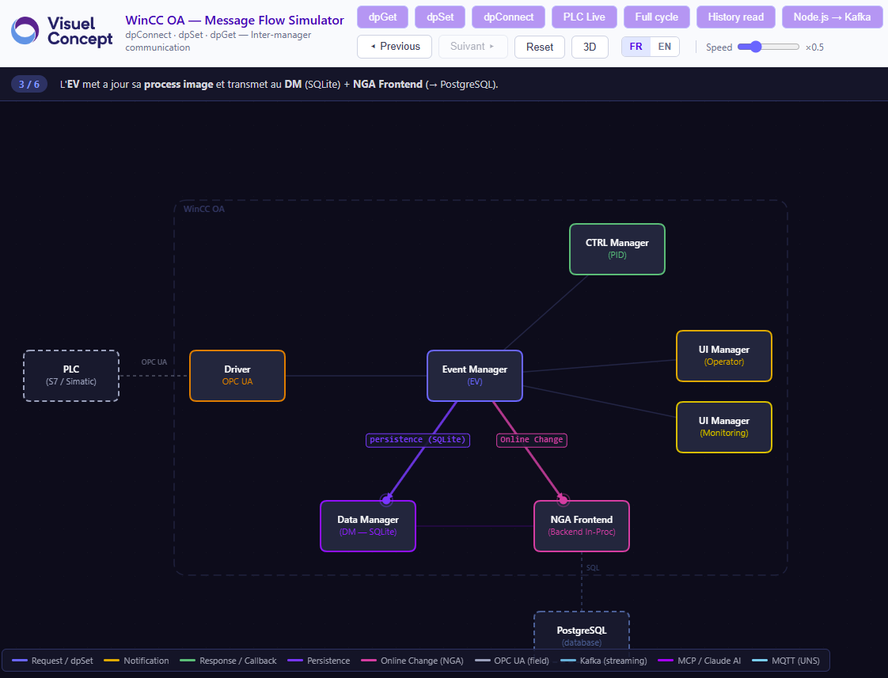
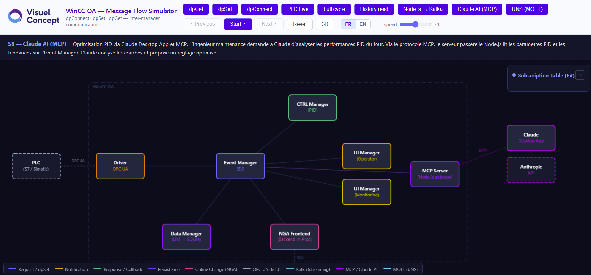
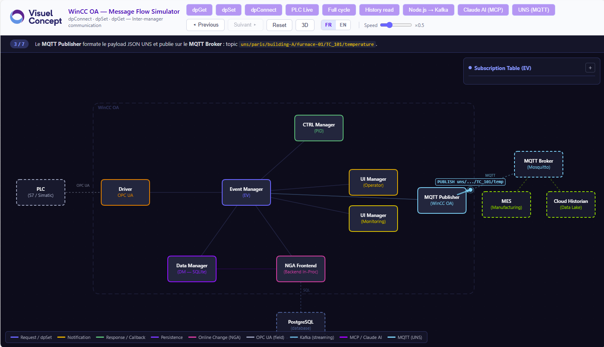

# WinCC OA Message Flow Simulator

Interactive step-by-step animation showing how messages travel between WinCC OA managers. Select a scenario, click through each step, and watch the flow unfold — who sends what, how the Event Manager routes it, who gets notified and why.

**Single HTML file, zero installation** — opens in any browser.

**[Live demo](https://orelmi.github.io/winccoa-message-flow-simulator/)** — hosted via GitHub Pages.



## Scenarios

| # | Scenario | What it shows |
|---|----------|---------------|
| 1 | **dpGet** | Synchronous read from the Event Manager's process image |
| 2 | **dpSet** | Value write propagating through EV to all subscribers |
| 3 | **dpConnect** | Subscription registration and automatic callback on change |
| 4 | **PLC Live** | Spontaneous field value change propagating to all UIs (no polling) |
| 5 | **Full cycle** | End-to-end from PLC through EV to archiving (NGA/PostgreSQL) |
| 6 | **History read** | NGA/PostgreSQL retrieval path |
| 7 | **Node.js to Kafka** | Streaming integration via JS Manager |
| 8 | **Claude AI (MCP)** | PID optimization via Claude Desktop App and MCP Server |
| 9 | **UNS (MQTT)** | Unified Namespace with MES and Cloud Historian |

### Claude AI (MCP) — PID Optimization



### UNS (MQTT) — Unified Namespace



## Features

- **Live subscription table** and **EV process image** — see what the Event Manager holds in memory at each step
- **Bilingual step descriptions** (FR/EN), auto-detected from browser locale
- **Experimental 3D mode** (Three.js)
- Step-by-step navigation with Previous/Next controls and adjustable speed

## What this tool is not

This simulator is a **teaching aid**, not a live debugging or monitoring tool. It does not connect to a running WinCC OA system or capture real traffic between managers. The message flows, values, and timings shown are pre-defined scenarios designed to illustrate how the architecture works under the hood. Think of it as an animated textbook diagram — accurate in principle, simplified for clarity.

## Quick start

Open [winccoa-message-flow.html](winccoa-message-flow.html) in your browser. That's it.

## Development

Source files are in `src/`. Never edit `winccoa-message-flow.html` directly.

```
src/
  index.html          # HTML shell with injection markers
  style.css           # Stylesheet
  renderer3d.js       # 3D module (Three.js) — optional
  core/               # Core engine (edit without touching scenarios)
    i18n.js           #   Translation system (shared keys)
    managers.js       #   Manager definitions, layout, visibility
    state.js          #   Process image, subscriptions
    renderer.js       #   Canvas drawing, message animation
    engine.js         #   Scenario runner, step navigation, registry
    ui.js             #   Panel toggle/drag, initialization
  scenarios/          # One file per scenario (self-registering)
    dpget.js          #   S1 — dpGet
    dpset.js          #   S2 — dpSet
    dpconnect.js      #   S3 — dpConnect
    plclive.js        #   S4 — PLC Live
    cycle.js          #   S5 — Full cycle
    history.js        #   S6 — History read
    kafka.js          #   S7 — Node.js to Kafka
    mcp.js            #   S8 — Claude AI (MCP)
    uns.js            #   S9 — UNS (MQTT)
```

### Adding a new scenario

Create a file in `src/scenarios/` (e.g., `myscenario.js`). It must:
1. Add its i18n step keys via `Object.assign(i18n.fr, {...}); Object.assign(i18n.en, {...});`
2. Define its async scenario function
3. Self-register: `registerScenario('myScenario', scenarioMyScenario);`

No changes to core files needed.

### Build

After editing any source file, rebuild:

```bash
python build.py
```

This assembles `src/` into a single self-contained HTML file with inlined CSS/JS, and copies it to `docs/index.html` for GitHub Pages.

### GitHub Pages setup

1. Push the repository to GitHub
2. Go to **Settings > Pages**
3. Source: **Deploy from a branch**
4. Branch: `main`, Folder: `/docs`
5. Save — the site will be live at `https://orelmi.github.io/winccoa-message-flow-simulator/`

## Contributing

Feedback welcome — missing scenarios, things to clarify, bugs to fix. Open an issue or submit a pull request.

## Author

Built by **Visuel Concept** — WinCC OA training and integration.

## License

MIT
